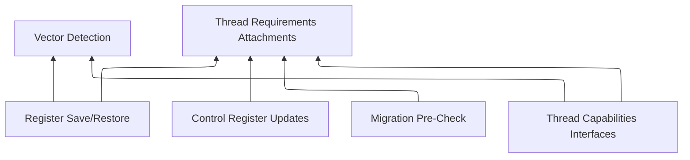

I need to save/restore vector/FP state using either `FXSAVE` or `XSAVE` if either are available.

> It should be noted that "vector state" or "vector registers" is the predominate way I refer to the entirety of CPU extension state that can/should be preserved, including non-vector extensions. Assume I'm referring to 'all of it' when I use those terms.

The problem comes with mixed-processor systems, such as Alder lake. I actually don't know if they have different vector save/restore capabilities but I would _assume_ that there might be some x86_64 CPUs out there that have varying levels of vector component support within a single CPU.

The problem comes with threading support. If a thread uses e.g. AVX-512 instructions is scheduled on core A (with AVX-512 support) but then gets migrated to core B (**without** AVX-512 support), that thread is going to have spurious `#UD` exceptions, I'd imagine. That'd cause headaches, hard-to-debug cases, etc. - nightmares for users and developers alike, as it'll cause random crashes at random times based on workload, only on certain machines, many of which wouldn't be readily available for debugging.

Further, I've been bitten by the whole "vector extensions supported?" plague before; sometimes they are, and you want to use optimized functions if they are, without recompiling. This whole story is a mess, to be honest. I can't help _so much_ on the compiler end, but compilers _do_ have some support for this case (where support is detected at runtime and a lookup table is switched out) - for example, [GCC's `ifunc` attribute](https://webcf.waybackmachine.org/web/20250311015001/https://gcc.gnu.org/onlinedocs/gcc-5.3.0/gcc/Function-Attributes.html#index-g_t_0040code_007bifunc_007d-function-attribute-3095).

## A potential solution

So the solution here has a number of moving parts. A dependency diagram of the work that needs to be done:



### Vector Detection

The first step for implementing this is vector extension detection. This is [mostly complete](https://github.com/oro-os/kernel/compare/b58470cb8af4bec8c8a3a5b5fa005bbbf9f4a8b5..205e4dc52697128df8ea8b89d473eac84f5ec630), the logic just isn't there to actually use the data quite yet.

The use of certain compiler features is definitely going to be whitelist-based as each will require its own mechanism for enablement.

Vector detection will happen once per-core, at boot time. **It's not at this time that vector extensions are enabled.** Certainly, they are never enabled for the supervisor mode either, if it can be helped (as the kernel does not have / should not have them enabled). This very well might change in the future if there's a good reason for it but I don't personally see a need.

### Thread Requirements Attachments

This is a sort of "synthesized" kernel concept, I'm sure there's a better name for it. In essence, threads would have a list of capabilities (a bitmap, either conceptually or literally) that the thread has explicitly stated it needs. Not all threads in a process will need specific capabilities, and thus the entire process need not be penalized scheduler-wise if it's not necessary.

This is not an entirely foreign or novel concept; thread flags are common elsewhere - for example, affinity - that affect how they are scheduled. The goal here is to make them explicit, enumerable, etc. through the use of syscalls, which are already statically enumerated. This would mean that, for example, any package manager could see that a module has the following syscalls...

```
OP_GET, KERNEL_X8664_THREAD_REQ, "avx512"
OP_GET, KERNEL_X8664_THREAD_REQ, "sse"
```

... and know that the program _might_ request for those features to be enabled for a thread at some point during its execution.

The appropriate thread requirement will be 'tagged' onto it in the kernel's data structures, allowing other parts of the x86_64 architecture implementation within the kernel use them to determine what sorts of operations need to take place (namely, during interrupts, scheduling, etc).

### Register Save / Restore

The next step is to handle register saves and restores. I'll be upfront about the fact that this particular implementation will probably be quite organic, changing a lot over the lifetime of the Oro kernel project, as I'm sure the first attempt at doing this won't be the most efficient or ideal.

Based on the Thread Requirements Attachments (notably, _not_ based on Vector Detection, except perhaps for bugcheck assertions in debug mode to make sure the save/restore is available on the given core), the vector and floating point state is saved to the thread using either `FXSAVE` or `XSAVE`.

Which of the two mechanisms (or neither) to use is stored on the thread handle, rather than per-core. There are subtle differences between the "legacy" `FXSAVE` format and that of `XSAVE`, and in cases where the thread has been migrated to/from a core that supports `XSAVE` from/to a core that only supported `FXSAVE`, the more-capable core must also still use `FXSAVE`.

> I'm not 100% sure about this, to be honest - there is a long, diverse history of various chips supporting various things. XSAVE may be specified as handling FXSAVE state, I don't know. I'd rather err on the side of it not doing so, and having someone much smarter than me eventually find that to optimize it at some point.

How that's actually implemented is TBD. There are a few options:

- Switch out IDT at context switch time. My gut intuition says it wouldn't be very performant.
- Switch out IDT entries at context switch time. That probably means switching a page somewhere, as the IDT is a linear address rather than a physical page. However, I don't know if the `LIDT` function performs a page walk first to find a physical address or not; I assume not, because then it'd have to take into account page boundaries, or store those vectors in some internal data structure. The 'vibe' doesn't feel good with this approach.
- Software-based interrupt routing, which is probably the most robust but branch-heavy.

The first implementation will probably use software-based routing but who knows. Needs more research.

### Control Register Updates

Along with Register Save / Restore mechanisms, control registers that allow the use of certain vector extensions will be [modified](https://wiki.osdev.org/SSE#Adding_support) upon context switch based on the requested support level.

Why do this at all? Because if they're enabled CPU-wide, then _every_ context switch pays the price for register save/restore. Even if they were enabled, but preservation was still explicit, that'd lead to weird, hard to debug failures and potentially even data leaks.

Take the example of a thread that has extended registers populated with an encryption key. A malicious thread would only need to read those registers in an endless loop, testing the contents for a valid key they're looking for until it discovers one by simply not telling the kernel it wants vector register preservation. Since the kernel wouldn't otherwise modify those registers when switching into the malicious thread, whatever was there is left over from the last thread that modified them.

> This works in _theory_. To the extent that such things can be prevented is TBD and in the event it cannot be made safe then unfortunately a performance tradeoff will have to be made.

### Thread Capabilities Interfaces

The ability to attach requirements to the threads will need kernel interfaces. How they're invoked is no different than any other interface, but _when_ is a good question. If they're explicit, then every program written would have to issue those calls, which isn't great DX.

Probably the most sensible solution here is to detect the compilation features during a build and add those to the `_start` of a program automatically. Then if someone wants to add explicit support, they can use e.g. `#[target_feature(enable = "avx")]` on a function and be sure to call the appropriate thread attachment interface beforehand to indicate to the kernel such instructions will be invoked.

- [`#[target_feature]`](https://web.archive.org/web/20250304090954/https://raphlinus.github.io/rust/simd/2018/10/19/fearless-simd.html)
- [`is_x86_feature_detected!()`](https://web.archive.org/web/20250126163549/https://doc.rust-lang.org/std/macro.is_x86_feature_detected.html)

It should be noted that threads will be able to attach _and detach_ requirements at random, as there's nothing racy about that and has well defined semantics and behavior (as long as the thread is alright with syscall overhead, in whatever form).

### Migration Pre-Check

Finally, when threads are migrated between cores, the target core candidate is first checked to determine if it meets all the requirements the thread has asked for. If so, the migration goes through. If not, the scheduler would submit it again for re-consideration by another core.

Easily stated, but that requires what amounts to a complete rewrite of the scheduler as it exists today. The idea of a "modular scheduler" that is userspace controlled becomes a bit more attractive each day, but that's another topic.

Migration is already a hairy topic, and it's not handled efficiently right now in the kernel, but at least I understand the problem and the current implementation is _correct_, if not a bit awkward.

The other problem is if a core crashes and no other cores have the required capabilities for which that thread may resume. Most likely, this would result in a thread termination, but perhaps there's a future where the thread could react to this and change its requirements. This also brings up the "thread interrupt" question again, and how the kernel will tackle that. It's still up for debate (with myself), but I have ideas -- again, another topic.

